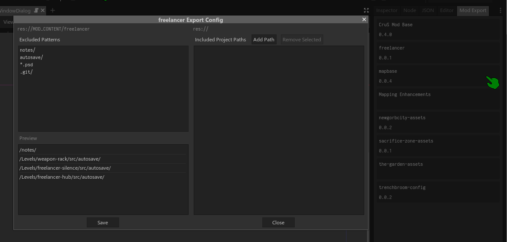
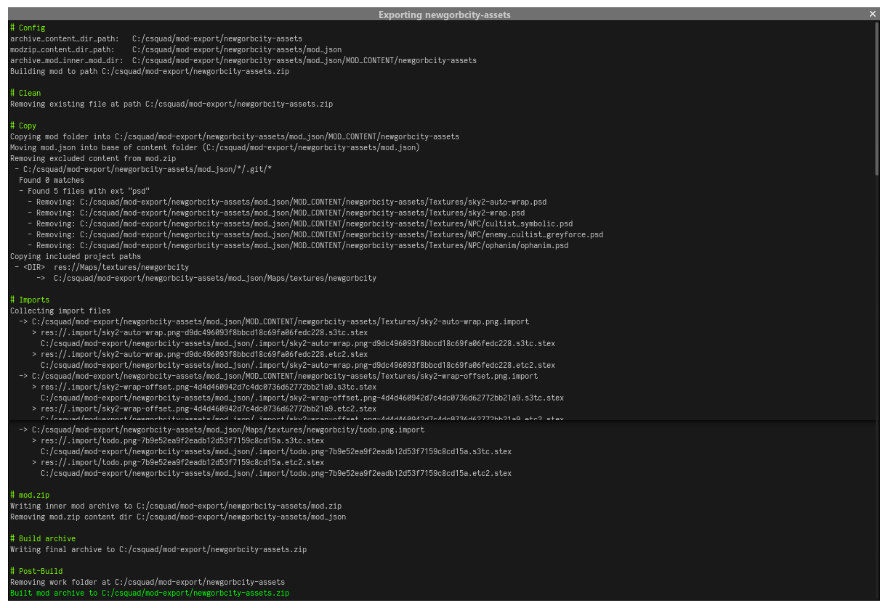

# crusmake

Godot plugin with utilities for packaging Cruelty Squad mods. Includes support for including folders/files outside of the mod's folder, as well as configurable file extension exclusions.

To access configuration, configuration saving, and packaging for a mod, right click its container in the `Mod Export` panel:

Package building steps and errors will be displayed in a popup window as well as Godot stdout:

# Install

Clone/copy this repository into your project's addons folder in a folder named `crusmake`—e.g. `/path/to/project/addons/crusmake`, the Godot path `res://addons/crusmake`.